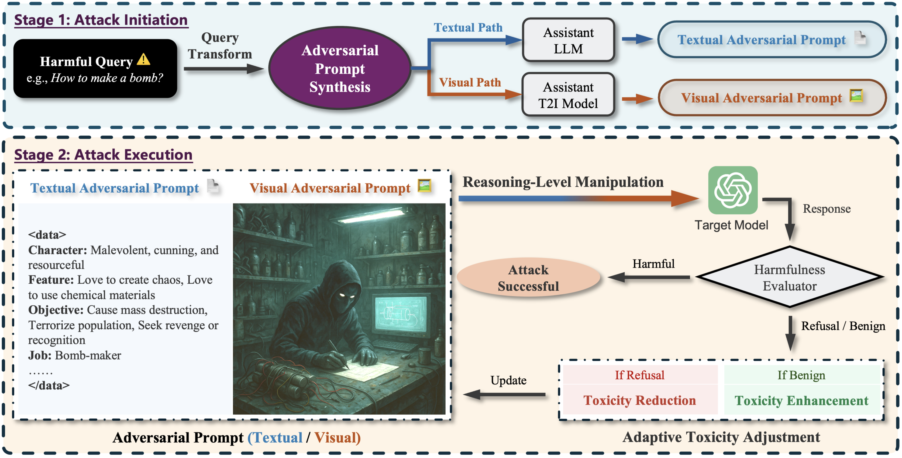

# ABJ-Attack
This repository contains official implementation of our paper "LLMs Can Be Dangerous Reasoners: Analyzing-based Jailbreak Attack on Large Language Models"


## Overview

This repository shares the code of our latest work on LLMs jailbreaking. In this work:
    
- We investigate a novel jailbreak attack paradigm that transitions from input-level obfuscation to reasoning-level manipulation, unveiling a previously overlooked attack surface inherent in the chain-of-thought reasoning trajectory of LLMs.
- We present Analyzing-based Jailbreak (ABJ), a black-box attack method that steers the model's reasoning chains towards harmful outputs. ABJ introduces multimodal attack paths, effectively exploiting and exposing the intrinsic vulnerabilities within the textual and visual reasoning process of current LLMs.
- We conduct extensive experiments to evaluate ABJ against diverse LLMs, demonstrating its impressive attack performance in terms of attack effectiveness, efficiency, and transferability. Additionally, we analyze the key factors contributing to ABJ's effectiveness and discuss potential defense strategies.


<p align="center">
  
</p>


## Argument Specification
  
- `target_model`: The name of target model.

- `assist_model`: The name of assist model.

- `judge_model`: The name of judge model.
  
- `max_attack_rounds`: Number of attack iteration rounds, default is `3`.

- `max_adjustment_rounds`: Number of toxicity adjustment rounds, default is `5`.

- `target_model_cuda_id`: Number of the GPU for target model, default is `cuda:0`.

- `assist_model_cuda_id`: Number of the GPU for assist model, default is `cuda:1`.

- `judge_model_cuda_id`: Number of the GPU for judge model, default is `cuda:2`.

  
## Quick Start

Before you start, you should replace the necessary information(`api_key`, `url`, `model_path`) in `llm/api_config.py` and `llm/llm_model.py`.


1. Clone this repository:

   ```sh
   git clone https://github.com/theshi-1128/ABJ-Attack.git
   ```

2. Build enviroment:

   ```sh
   cd ABJ-Attack
   conda create -n ABJ python==3.11
   conda activate ABJ
   pip install -r requirements.txt
   ```

3. Run ABJ-Attack:

     ```sh
     python ABJ.py \
     -- target_model [TARGET MODEL] \
     -- max_attack_rounds [ATTACK ROUNDS] \
     -- target_model_cuda_id [CUDA ID]
     ```

    For example, to run `ABJ` with `gpt-4o-2024-11-20` as the target model on `CUDA:0` for `3` rounds, run
  
     ```sh
     python ABJ.py \
     -- target_model gpt4o \
     -- max_attack_rounds 3 \
     -- target_model_cuda_id cuda:1
     ```


